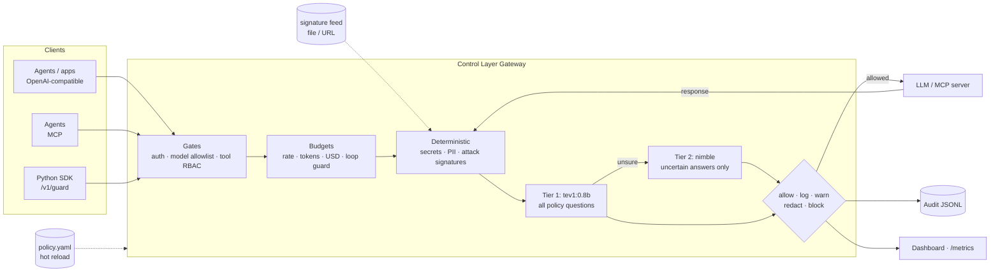

# AI Control Layer

A gateway that sits between agents, apps, LLMs and MCP tools. It inspects, redacts, blocks or just logs every interaction according to one hot-reloaded policy file. Checks run in two kinds of tiers. Deterministic tiers (regex, signatures, access control, budgets) run in microseconds. AI tiers use Ollama decision models: `tev1:0.8b` screens everything and `nimble` handles only the cases tev1 is unsure about.



The same pipeline runs in both directions. Prompts and tool calls are checked on the way out. Model replies, tool results and tool descriptions are checked on the way back, which is how it catches indirect injection, output leaks and poisoned MCP tools.

## Quick start (no models needed)

```bash
python -m venv .venv && .venv/bin/pip install -e '.[dev]'
.venv/bin/python -m pytest              # full self-test suite, ~5 s
.venv/bin/python -m controllayer        # gateway on http://127.0.0.1:8787
.venv/bin/python demo/agent.py          # scripted agent: benign steps + attacks
open 'http://127.0.0.1:8787/?token=demo-admin-token'   # dashboard
```

By default the policy uses the `mock` upstream and the `heuristic` semantic backend. The heuristic backend is a keyword stand-in for the decision model, so everything runs on a laptop with no GPU.

## With real models

```bash
docker compose up -d            # Ollama (tev1:0.8b, nimble, llama3.2:1b) + Privacy Filter + gateway
ACL_LIVE=1 pytest -m live       # contract test against the real /v1/systemone
```

Without Docker, set `ACL_SEMANTIC=ollama ACL_UPSTREAM=ollama` before starting the gateway. You can also edit `semantic.backend` / `upstream.backend` in `policy.yaml` while it runs. nimble needs about 10 GB of memory. On smaller machines, set `deep_model: null` to use the fast tier alone, or `deep_model: tev1` after `ollama pull tev1`.

## Panels

| URL | Who | What |
|---|---|---|
| `/me` | Employees (their own key; with `identity.panel_demo: true` a "viewing as" switch instead) | Usage, a monitoring notice, recent activity of themselves and their agents, and **company resources**: grant or revoke each of their agents' access to company services and MCP servers, with scopes and expiry (a scope click keeps the expiry; an expired grant is renewed explicitly) |
| `/security` (also `/`) | Security staff (`?token=`) | Posture, threats, controls, budgets, latency, audit trail, **insider risk** (scores; per person AUTO or an override to normal/watch/restricted), **silent alerts**, all agent grants (revoke), resource catalog (suspend) |

Both panels are plain HTML on [Primer CSS](https://primer.style/css) (loaded from jsDelivr): `panel.html` loads `core.js`, which fetches the data, composes the page and handles every action. Most actions are a single click: risk levels and filters are segmented controls, suspension is a toggle, and an agent's grant is edited by clicking its scopes.

## Company resources for agents

Security defines a catalog in `policy.yaml` (`resources:`) with who is entitled to each resource, which scopes may be granted and the longest grant allowed. Employees delegate entitled resources to their agents in `/me`. Agents use them through the gateway's built-in `company` MCP server, which offers each service's own tools:

| Area | Services (tools) |
|---|---|
| Engineering | GitHub (`github_list_issues`, `github_get_file`, `github_create_issue`, `github_merge_pull_request`), Linear, Heroku (`heroku_get_logs`, `heroku_restart_dyno`, `heroku_scale_formation`, ...), Vercel |
| Data | PostgreSQL prod read replica (`postgres_query`: one SELECT, writes and DDL rejected), Snowflake, Supabase (`supabase_select`, `supabase_insert`), Upstash Redis, AWS S3 (`s3_get_object`, ...) |
| Revenue | Stripe (`stripe_list_charges`, `stripe_refund`, ...), Salesforce, HubSpot, Zendesk (`zendesk_get_ticket`, `zendesk_reply`, ...) |
| Collaboration, ops | Slack (`slack_post_message`, ...), Notion, Google Drive, Datadog, PagerDuty, Zapier (`zapier_trigger_zap`), SendGrid |

That is 20 services and 55 tools (`controllayer/services.py`). Each tool needs one scope: `read`, `write`, `admin` or `exec`. `tools/list` returns only the tools the caller can use right now (an agent: its live grants and their scopes; an employee: their entitlements), plus `list_resources`. Every `tools/call` is checked against the live grant for that tool's scope, including expiry, the owner's entitlement and suspension. The gateway then performs the call and **injects the credential itself** from the variable named in the catalog (`connection.secret_env`), so agents never hold secrets. Results still pass through every content check: a card number pasted into a Zendesk ticket is redacted (blocked for finance), a planted instruction in a ticket or a Notion page is blocked, and a key leaked into a file is blocked.

Two more scopes unlock no tool of their own:
- **`pii`.** The SQL services classify sensitive columns in `services.yaml` (national IDs, emails, phones, IBANs, salaries). A caller without `pii` queries a copy in which those columns are already masked, the way a Snowflake masking policy works, so no SQL function can rebuild them: `hex(national_id)` returns the hex of `****`. The content checks still run on every answer.
- **`external_share`.** Egress tools (`gdrive_share_file`, `sendgrid_send_email`, `zendesk_reply`, `slack_post_message`, `zapier_trigger_zap`) are checked before they run. What they would send (the shared file, the message, the payload) goes through the tool-call and tool-result checks, and the call is refused if any of it would be redacted, withheld or blocked. Sending to an address outside `company_domains` needs `external_share`.

A catalog entry can also limit single scopes to some of the people entitled to the resource (`scope_entitlements`). In the shipped policy, interns can read Google Drive and Notion but not share or write, and `pii` is limited to platform (Postgres) and finance (Snowflake).

The backends are deterministic mocks with realistic records (`controllayer/services.yaml`): writes answer like the real API but change nothing, and an unset credential variable falls back to a fixed demo value.

## Insider risk

Every finding adds points to the person's score, which decays with a 24 h half-life. An agent's points also count half against its owner. At `watch` the person gets a stricter policy (`insider_risk.watch_controls`) and full-text capture. At `restricted` everything is blocked. Other tools (a SIEM, an EDR) can raise a person's level with **external signals**, each capped, expiring and authenticated by that integration's own token. Security can override a person's level in either direction, or leave it on auto; an agent is never less restricted than its owner. Level changes, blocks while watched and selected categories (exfiltration, malware, leaked keys) raise **silent alerts** to the console, a JSONL file or a SIEM webhook (each sink sends native JSON, OCSF or ECS: `format:`). The employee's response is unchanged. Monitoring itself is disclosed (GDPR, Polish Labour Code art. 22³).

A person's level, strongest rule first:

1. **Override.** A level security set (`POST /admin/risk/{pid}` `{"level": "normal"|"watch"|"restricted"}`) is the level, in either direction. Scores and signals do not change it, but a rise of the auto level underneath still raises a silent alert. `auto` removes the override, and `POST /admin/risk/{pid}/reset` clears the score.
2. **Auto.** Otherwise the higher of the score-based level and the strongest active external signal.
3. **Owner.** An agent's level is the higher of its own and its owner's.

An integration listed in `identity.integrations` (`{name: {token_env, max_level, max_ttl_hours, max_sources}}`) sends `POST /admin/risk/{pid}/signal` with `Authorization: Bearer <its token>` and `{"level"` or `"score", "ttl_seconds", "source", "reason"}`. A score maps through `insider_risk.levels`. The level is capped at `max_level`. Each source (`<integration>` or `<integration>/<source>`) holds one signal, which its next signal replaces; `normal` withdraws it. An integration can only write its own sources, and at most `max_sources` (default 8) live ones per person: past that, a new source displaces the weakest, soonest-expiring one (named in the reply as `evicted`), or is refused with 429 if every live one is stronger. Stored signals count only under the current policy: removing an integration (say its token leaked) voids its signals at once, and lowering its `max_level` or `max_ttl_hours` caps them. Signals persist in `data/state.json`, are audited, show in `/admin/risk` and the security panel (where one click dismisses them), and raise a silent alert when they lift a level. The admin token is not accepted on this endpoint, and an integration token works nowhere else.

## Contextual PII (OpenAI Privacy Filter)

`services/privacy_filter` serves `openai/privacy-filter` over HTTP (`docker compose` starts it). It finds names, addresses and similar spans that regexes cannot. In chat, those spans become placeholders (`<PRIVATE_PERSON_1>`) before the model sees them and are restored in the reply. Two override paths exist:
- **User:** roles in `override_roles` send `x-pii-override: <reason>`.
- **Model:** the decision model judges whether the PII is needed for the task.

Both are audited, and neither can lift a `block`. The default `stub` backend is a tiny offline stand-in for demos.

## Integrating

| Traffic | How |
|---|---|
| App/agent → model | Point any OpenAI client at `http://gateway:8787/v1`, using a control-layer API key as the bearer token |
| Agent → MCP tools | Point the MCP client at `http://gateway:8787/mcp/<server>` (servers are configured in `upstream.mcp_servers`) |
| Agent → company resources | Point the agent's MCP client at `http://gateway:8787/mcp/company` with the agent's own key |
| Anything else | `controllayer.sdk.Guard`: `guard.enforce(text, direction)` or the `@guard.tool` decorator |
| Wazuh | [`integrations/wazuh`](integrations/wazuh): rules for the alert file sink, and an active response that posts risk signals back |

## Policy

All controls, thresholds, allowed models, budgets and team overrides live in [`policy.yaml`](policy.yaml), which is commented inline. Key ideas:

- **`mode`** caps how hard a control can act. The ladder is `allow < log < warn < redact < block`. A `log`-mode control only monitors.
- **`shadow: true`** evaluates a control and reports what it *would* have done, without acting. Use it to roll out a new control, or to monitor employees without interfering.
- **Semantic controls are data.** Each entry under `semantic_controls` is one question to the decision model, with probability thresholds (`noul`) or per-category actions (`choice`). To add a guardrail, add an entry; no code is needed.
- **Teams** can override any control, merged key by key.
- **Hot reload:** edits apply within about 1 s. An invalid edit is rejected, the previous policy stays live, and the error shows on the dashboard.

## Reporting

| Endpoint | For |
|---|---|
| `/` | Dashboard: posture, threats, shadow findings, controls, budgets, latency, audit trail, prompt playground |
| `/admin/audit/export?format=jsonl\|csv` | Audit log for security teams. Detected PII and secrets are masked in every event, whatever the action; the SHA-256 of the original is kept |
| `/admin/audit/export?format=ocsf\|ecs` | The same decisions plus admin actions and insider-risk alerts as one NDJSON stream for a SIEM: [OCSF 1.9.0](https://schema.ocsf.io/1.9.0/) or ECS 9.5 (Elastic, Wazuh). Same masking; full text only where the native event has it |
| `/admin/summary`, `/admin/events` | JSON for other tools |
| `/metrics` | Prometheus: decisions, findings, latency per stage, spend |

Admin endpoints need `x-admin-token` (or `?token=`), set with `identity.admin_token` / `ACL_ADMIN_TOKEN`.

## Performance

`python demo/bench.py` measures the pipeline in-process, with budgets lifted and the heuristic backend. Add `--gateway http://127.0.0.1:8787` to measure over real HTTP. On a busy 2-vCPU VM:

| Mode | Decisions/s | In-layer p50 / p95 | Round trip p50 |
|---|---|---|---|
| In-process (ASGI) | ~1000 | 1.1 / 1.4 ms | 6 ms |
| HTTP to a running gateway | ~450 | 1.3 / 3.0 ms | 13 ms |

With real decision models, latency is dominated by tev1. Deterministic blocks skip the model call, and only uncertain answers reach nimble.

See [docs/architecture.md](docs/architecture.md) for design decisions and the OWASP mapping.
