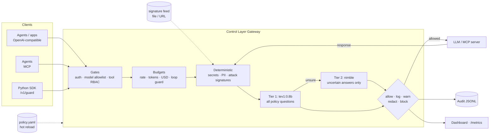

# AI Control Layer

A gateway that sits between agents, apps, LLMs and MCP tools. It inspects, redacts, blocks or just logs every interaction according to one hot-reloaded policy file. Checks run in two kinds of tiers. Deterministic tiers (regex, signatures, access control, budgets) run in microseconds. AI tiers use Ollama decision models: `tev1:0.8b` screens everything and `nimble` handles only the cases tev1 is unsure about.



The same pipeline runs in both directions. Prompts and tool calls are checked on the way out. Model replies, tool results and tool descriptions are checked on the way back, which is how it catches indirect injection, output leaks and poisoned MCP tools.

## Quick start (no models needed)

```bash
python3.12 -m venv .venv && .venv/bin/pip install -e '.[dev]'
make web                                # build the console (Node 20+); without it you get the old HTML dashboard
.venv/bin/python -m seed --data-dir data/demo           # 30 days of a 5,000-person bank
.venv/bin/python -m controllayer --data-dir data/demo   # gateway and console on http://127.0.0.1:8787
open http://127.0.0.1:8787/             # sign in with demo-admin-token
```

Other useful commands:

```bash
.venv/bin/python -m pytest              # full self-test suite
.venv/bin/python -m controllayer --data-dir data/fresh   # same policy, empty state (or ACL_DATA_DIR)
.venv/bin/python demo/live.py           # the live demo, beat by beat, against a running gateway
```

`web/dist` is not committed: after pulling changes to `web/`, run `make web` again.

By default the policy uses the `mock` upstream and the `heuristic` semantic backend. The heuristic backend is a keyword stand-in for the decision model, so everything runs on a laptop with no GPU.

## With real models

```bash
docker compose up -d            # Ollama + pulls tev1:0.8b, nimble, llama3.2:1b + gateway
ACL_LIVE=1 pytest -m live       # contract test against the real /v1/systemone
```

Without Docker, set `ACL_SEMANTIC=ollama ACL_UPSTREAM=ollama` before starting the gateway. You can also edit `semantic.backend` / `upstream.backend` in `policy.yaml` while it runs. nimble needs about 10 GB of memory. On smaller machines, set `deep_model: null` to use the fast tier alone, or `deep_model: tev1` after `ollama pull tev1`.

## Integrating

| Traffic | How |
|---|---|
| App/agent → model | Point any OpenAI client at `http://gateway:8787/v1`, using a control-layer API key as the bearer token |
| Agent → MCP tools | Point the MCP client at `http://gateway:8787/mcp/<server>` (servers are configured in `upstream.mcp_servers`) |
| Anything else | `controllayer.sdk.Guard`: `guard.enforce(text, direction)` or the `@guard.tool` decorator |
| Ask before acting | `POST /v1/authorize` `{action, resource, context}` returns Allow/Deny for a catalogued resource, without doing anything |
| Usage from elsewhere | `POST /v1/events` (CloudEvents 1.0, one or a batch), `POST /v1/usage` (a quantity of a resource), `POST /v1/import/focus` (a cloud bill as FOCUS CSV) |

## Policy

All controls, thresholds, allowed models, budgets and team overrides live in [`policy.yaml`](policy.yaml), which is commented inline. Key ideas:

- **`mode`** caps how hard a control can act. The ladder is `allow < log < warn < redact < block`. A `log`-mode control only monitors.
- **`shadow: true`** evaluates a control and reports what it *would* have done, without acting. Use it to roll out a new control, or to monitor employees without interfering.
- **Semantic controls are data.** Each entry under `semantic_controls` is one question to the decision model, with probability thresholds (`noul`) or per-category actions (`choice`). To add a guardrail, add an entry; no code is needed.
- **Teams** can override any control, merged key by key.
- **Hot reload:** edits apply within about 1 s. An invalid edit is rejected, the previous policy stays live, and the error shows on the dashboard.

## Reporting

| Endpoint | For |
|---|---|
| `/` | Admin console (React, `make web`): overview, workflows, security, resources, requests, people and teams |
| `/api/me/*` | JSON for an employee's own tools, with their own API key: usage, quota, menu, runs, leases, blocked events, admin activity about them |
| `/admin/overview`, `/admin/usage?by=workflow,task`, `/admin/menu`, `/admin/leases`, `/admin/incidents`, `/admin/principals`, `/admin/requests`, `/admin/actions` | Governance JSON; POST variants change restrictions |
| `/admin/audit/export?format=jsonl\|csv` | Audit log for security teams. Detected PII and secrets are masked in every event, whatever the action; the SHA-256 of the original is kept |
| `/admin/catalog`, `/admin/grants` | The resource catalog by class, with usage, live leases and live grants |
| `/admin/export/focus?days=30` | AI spend as a FinOps FOCUS 1.1 CSV, ready for finance tools |
| `/admin/export/backstage` | The catalog as Backstage `kind: Resource` entities |
| `/admin/summary`, `/admin/events` | JSON for other tools |
| `/metrics` | Prometheus: decisions, findings, latency per stage, spend |

Admin endpoints need `x-admin-token` (or `?token=`), set with `identity.admin_token` / `ACL_ADMIN_TOKEN`.

## Usage governance

The same gateway meters and limits *what AI work costs*, not just what it says.

- **Workflow menu.** `menu.workflows` lists the kinds of work people do with AI (`pr_review`, `ui_qa`, `data_analysis`, ...). Each item says who may run it, which models, tools and resources it uses, what one run may cost, and whether it needs approval. Clients label traffic with `x-acl-workflow`, `x-acl-task` and `x-acl-session` headers. Unlabeled chat is attributed by one extra question in tev1's existing call. That guess is used for reporting only and never to refuse a request.
- **Measured prices.** Every item shows what a run really costs (typical and p90), computed from history. Costs include tokens, simulator and VM minutes, and CI minutes.
- **Resources beyond tokens.** MCP tools that start a simulator, VM or browser (`boot_simulator`, argent's `boot-device`, `create_vm`) open a **lease**, and stop tools close it. The gateway bills leases per minute, caps how many each person can run at once, and flags leases idle past a limit (zombies). Resources can be set to stop zombies automatically. Usage the gateway cannot see is reported with `POST /v1/usage`.
- **Restrictions.** Admins can quarantine (read-only tools, 10% budget), revoke, scale budgets, approve workflows, and turn menu items off. Each change is validated, written to `data/admin-overlay.yaml` (merged over `policy.yaml`, hot-reloaded) and logged with a reason. Past 80% of a budget, requests are routed to a cheaper model instead of being refused.
- **Security from usage.** Detections combine usage with verdicts: probing (repeated blocks), exfiltration (double weight when it comes with a token spike), usage spikes, a key used from a new client, sensitive tools an agent never used before, repeated secret pastes, and zombie or unlabeled resources. Incidents add to a per-person **risk score** that halves every 2 h. Crossing thresholds first tightens the person's budget, then quarantines them. Only an admin relaxes a restriction.
- **One console.** `/` is the admin console for platform, FinOps and security people. Employees have no screen of their own; `/api/me/*` gives their tools the same facts with their own API key: spend, budgets, menu prices, runs, running resources, what was blocked and why, and every admin action or content view concerning them. Viewing one person's events needs a stated reason, which that person can see.

```bash
.venv/bin/python -m controllayer &
.venv/bin/python demo/governance.py          # labelled work, simulators, an approval, an insider escalating
open http://127.0.0.1:8787/   # sign in with demo-admin-token
```

Usage, leases, incidents and approvals are stored in SQLite (`usage.path`), so budgets and history survive restarts.

## Resource catalog

Everything an agent can touch is an entry under `catalog:` in `policy.yaml`. An entry might be a model, a subscription, a simulator, a VM, CI minutes, a cloud account, the production database, a deploy or external email. Each one is named by a URN (`urn:shield:<category>:<provider>:<type>`) and belongs to one of three classes, each measured and limited differently:

| Class | Examples | Measured in | Limited by |
|---|---|---|---|
| `consumable` | LLM tokens, Claude Code usage, CI minutes, cloud spend | a quantity in a unit | daily budgets per person, team and workflow; a cheaper model past 80% |
| `leasable` | iOS simulators, sandbox VMs, browsers | minutes held | concurrent leases, maximum duration, idle shutdown |
| `access_grant` | prod database, prod deploy, external email | uses | a time-boxed grant approved by an admin, or a workflow that includes it |

There is one evaluator for all three classes (`controls/resources.py: authorize`), in Cedar's shape: a principal, an action, a resource and a context. The gateway uses it on every tool call, and `POST /v1/authorize` exposes it to other systems. Employees request a grant from `/me`, and admins approve it or grant it directly (`POST /admin/principals/{id}/grants`). A grant is stored in the shape of an OAuth RAR (RFC 9396) `authorization_details` entry: resource, URN locations, actions, an optional workflow and an expiry. While it is live, it also lets the tool past the role list and the irreversible list. Each grant is logged and shown to the employee.

The catalog is built on existing standards rather than a home-grown format:

| Concern | Standard |
|---|---|
| Decisions | Cedar's principal / action / resource / context |
| Identity | URNs (like AWS ARNs), with wildcards |
| Catalog | Kubernetes-style entries, exported to Backstage |
| Events | CloudEvents 1.0, with OpenTelemetry GenAI attributes |
| Cost records | FinOps FOCUS 1.1 export and import |
| Grants | OAuth RAR `authorization_details` |
| Quota signalling | IETF `RateLimit-Policy` / `RateLimit` headers |

Older policies with `resources:` and `budgets.pricing` still load: they are folded into the catalog.

## Traps

Some things in a company should never be touched by anyone: nothing legitimate needs them. `decoys:` in `policy.yaml` plants a few that look real and valuable, like an unpublished Q3 board pack in the finance folder or a "full customer master export" in the data catalog. They are listed where people and agents look (document search, the catalog), so finding one is harmless. Using one is not:

| What happened | Rule | Effect |
|---|---|---|
| A tool call names the decoy (MCP, or a Claude Code `Read` of a planted file) | `decoy_touch` (weight 100) | High-severity incident, quarantine at once |
| The decoy's marker shows up in a prompt or tool call: its content is being moved on | `decoy_touch` | Same |
| A prompt asks for it by name ("the unpublished board pack") | `decoy_mention` (weight 30) | An alert: maybe just curiosity |

The gateway answers an opening call itself with the decoy's fake `content`, so no real system is involved and the person sees an ordinary result. Search results, tool results and conversation history never count. Employees never learn that it was a trap: in everything they can see about themselves it is "restricted material". Admins see each trap, where it is planted and who touched it on the Security page (`GET /admin/decoys`).

To catch Claude Code too, put a file with a decoy's name in the repositories people work in (for example `finance/board-pack-Q3-2026-UNPUBLISHED.pdf`): the `PreToolUse` hook sees the `Read`. Decoy strings that work without any of this, through the signature feed, live in [Shpont-Shield-Redteam](https://github.com/HackNuggets2026/Shpont-Shield-Redteam)'s Tripwire.

## Claude Code

Claude Code reports to the gateway and is governed by the same `policy.yaml`. The setup is in [`deploy/claude-code/`](deploy/claude-code/README.md).

- **Observe:** its OpenTelemetry export (OTLP over HTTP JSON at `/v1/logs` and `/v1/metrics`) provides cost and tokens per API call, tool accept and reject decisions, lines of code, commits, PRs and active time. People are identified by their key, or by `user.email` when a central collector forwards telemetry. Money comes only from `api_request` events, so it is never counted twice, and prompt text is never stored.
- **Enforce:** hooks (`/v1/hooks/claude-code`) check every prompt before it is sent and every tool call before it runs. The checks cover secrets, PII, signatures, budgets, the role's and workflow's tool lists, access grants and simulator caps. The hooks also open and close leases for MCP simulators. HTTP hooks fail open; the command-hook variant fails closed.
- **Detect:** bypass permission mode, MCP servers that are not on the approved list, and a run of rejected tool calls each open an incident.

This was verified live with Claude Code 2.1.288: a pasted AWS key was blocked before it was sent, and the session's cost showed up under `bugfix/DEMO-1`.

## One event stream

Gateway checks, lease starts and stops, incidents, usage reports, CloudEvents and imported bills all land in the `events` table, with one set of fields: source, kind, who (principal, team, client, session), what for (workflow, task), on what (resource, URN, model, tool), the decision, severity and cost. Telemetry that names a person by email is joined to the directory through `identity.api_keys.*.email`. Events that carry cost are also written to the usage ledger and count against today's budgets. A missing price is taken from the catalog.

## Performance

`python demo/bench.py` measures the pipeline in-process, with budgets lifted and the heuristic backend. Add `--gateway http://127.0.0.1:8787` to measure over real HTTP. On a busy 2-vCPU VM:

| Mode | Decisions/s | In-layer p50 / p95 | Round trip p50 |
|---|---|---|---|
| In-process (ASGI) | ~1000 | 1.1 / 1.4 ms | 6 ms |
| HTTP to a running gateway | ~450 | 1.3 / 3.0 ms | 13 ms |

With real decision models, latency is dominated by tev1. Deterministic blocks skip the model call, and only uncertain answers reach nimble.

See [docs/architecture.md](docs/architecture.md) for design decisions and the OWASP mapping.
