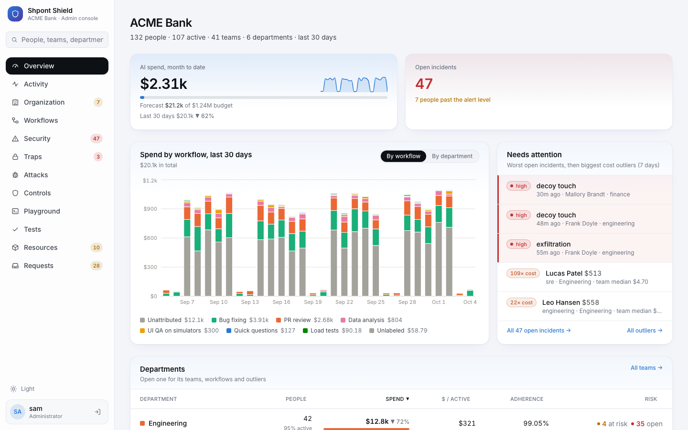

# Shpont Shield



## How to run it

Requirements: macOS or Linux, Python 3.11+ (or uv), Node 20.

```bash
git clone https://github.com/HackNuggets2026/Shpont-Shield-Unified
cd Shpont-Shield-Unified
make setup       # Python and console dependencies, builds the console
make selftest    # full test suite plus a per-control positive/negative report and JUnit XML
make demo        # seeds a month of history for a bank and starts the gateway
```

Open the console URL it prints and sign in with the admin token `demo-admin-token`.

Optional: `make redteam` (attack sidecar for Console > Attacks) and `python demo/live.py --auto` (live demo traffic: a trap is opened, an insider is restricted).

Agents connect by changing their OpenAI base URL to the gateway's `/v1`.
