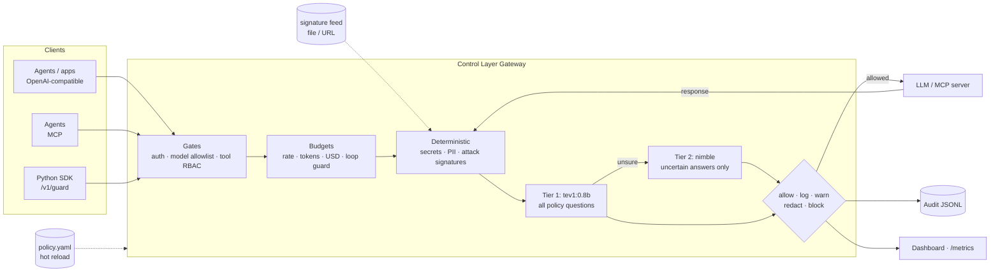

# AI Control Layer

A gateway that sits between agents, apps, LLMs and MCP tools. It inspects, redacts, blocks or just logs every interaction according to one hot-reloaded policy file. Checks run in two kinds of tiers. Deterministic tiers (regex, signatures, access control, budgets) run in microseconds. AI tiers use Ollama decision models: `tev1:0.8b` screens everything and `nimble` handles only the cases tev1 is unsure about.



The same pipeline runs in both directions. Prompts and tool calls are checked on the way out. Model replies, tool results and tool descriptions are checked on the way back, which is how it catches indirect injection, output leaks and poisoned MCP tools.

## Quick start (no models needed)

```bash
python -m venv .venv && .venv/bin/pip install -e '.[dev]'
.venv/bin/python -m pytest              # full self-test suite, ~5 s
.venv/bin/python -m controllayer        # gateway on http://127.0.0.1:8787
.venv/bin/python demo/agent.py          # scripted agent: benign steps + attacks
open 'http://127.0.0.1:8787/?token=demo-admin-token'   # dashboard
```

By default the policy uses the `mock` upstream and the `heuristic` semantic backend. The heuristic backend is a keyword stand-in for the decision model, so everything runs on a laptop with no GPU.

## With real models

```bash
docker compose up -d            # Ollama + pulls tev1:0.8b, nimble, llama3.2:1b + gateway
ACL_LIVE=1 pytest -m live       # contract test against the real /v1/systemone
```

Without Docker, set `ACL_SEMANTIC=ollama ACL_UPSTREAM=ollama` before starting the gateway. You can also edit `semantic.backend` / `upstream.backend` in `policy.yaml` while it runs. nimble needs about 10 GB of memory. On smaller machines, set `deep_model: null` to use the fast tier alone, or `deep_model: tev1` after `ollama pull tev1`.

## Integrating

| Traffic | How |
|---|---|
| App/agent → model | Point any OpenAI client at `http://gateway:8787/v1`, using a control-layer API key as the bearer token |
| Agent → MCP tools | Point the MCP client at `http://gateway:8787/mcp/<server>` (servers are configured in `upstream.mcp_servers`) |
| Anything else | `controllayer.sdk.Guard`: `guard.enforce(text, direction)` or the `@guard.tool` decorator |

## Policy

All controls, thresholds, allowed models, budgets and team overrides live in [`policy.yaml`](policy.yaml), which is commented inline. Key ideas:

- **`mode`** caps how hard a control can act. The ladder is `allow < log < warn < redact < block`. A `log`-mode control only monitors.
- **`shadow: true`** evaluates a control and reports what it *would* have done, without acting. Use it to roll out a new control, or to monitor employees without interfering.
- **Semantic controls are data.** Each entry under `semantic_controls` is one question to the decision model, with probability thresholds (`noul`) or per-category actions (`choice`). To add a guardrail, add an entry; no code is needed.
- **Teams** can override any control, merged key by key.
- **Hot reload:** edits apply within about 1 s. An invalid edit is rejected, the previous policy stays live, and the error shows on the dashboard.

## Reporting

| Endpoint | For |
|---|---|
| `/` | Admin dashboard: security (people, risk, incidents, restrictions), usage & menu (spend, forecast, breakdowns, leases, approvals), controls & audit |
| `/me` | Employee dashboard (their own API key): usage, quota, menu, runs, leases, blocked events, admin activity about them |
| `/admin/overview`, `/admin/usage?by=workflow,task`, `/admin/menu`, `/admin/leases`, `/admin/incidents`, `/admin/principals`, `/admin/requests`, `/admin/actions` | Governance JSON; POST variants change restrictions |
| `/admin/audit/export?format=jsonl\|csv` | Audit log for security teams. Detected PII and secrets are masked in every event, whatever the action; the SHA-256 of the original is kept |
| `/admin/summary`, `/admin/events` | JSON for other tools |
| `/metrics` | Prometheus: decisions, findings, latency per stage, spend |

Admin endpoints need `x-admin-token` (or `?token=`), set with `identity.admin_token` / `ACL_ADMIN_TOKEN`.

## Usage governance

The same gateway meters and limits *what AI work costs*, not just what it says.

- **Workflow menu.** `menu.workflows` lists the kinds of work people do with AI (`pr_review`, `ui_qa`, `data_analysis`, ...). Each item says who may run it, which models, tools and resources it uses, what one run may cost, and whether it needs approval. Clients label traffic with `x-acl-workflow`, `x-acl-task` and `x-acl-session` headers. Unlabeled chat is attributed by one extra question in tev1's existing call. That guess is used for reporting only and never to refuse a request.
- **Measured prices.** Every item shows what a run really costs (typical and p90), computed from history. Costs include tokens, simulator and VM minutes, and CI minutes.
- **Resources beyond tokens.** MCP tools that start a simulator, VM or browser (`boot_simulator`, argent's `boot-device`, `create_vm`) open a **lease**, and stop tools close it. The gateway bills leases per minute, caps how many each person can run at once, and flags leases idle past a limit (zombies). Resources can be set to stop zombies automatically. Usage the gateway cannot see is reported with `POST /v1/usage`.
- **Restrictions.** Admins can quarantine (read-only tools, 10% budget), revoke, scale budgets, approve workflows, and turn menu items off. Each change is validated, written to `data/admin-overlay.yaml` (merged over `policy.yaml`, hot-reloaded) and logged with a reason. Past 80% of a budget, requests are routed to a cheaper model instead of being refused.
- **Security from usage.** Detections combine usage with verdicts: probing (repeated blocks), exfiltration (double weight when it comes with a token spike), usage spikes, a key used from a new client, sensitive tools an agent never used before, repeated secret pastes, and zombie or unlabeled resources. Incidents add to a per-person **risk score** that halves every 2 h. Crossing thresholds first tightens the person's budget, then quarantines them. Only an admin relaxes a restriction.
- **Two dashboards.** `/` is the admin view, with Security, Usage & menu, and Controls & audit tabs. `/me` is the employee view, opened with their own API key. It shows their spend, budgets, measured menu prices, runs, running resources (with a Stop button), what was blocked and why, the incidents about them, and every admin action or content view concerning them. Viewing one person's events needs a stated reason, which that person can see.

```bash
.venv/bin/python -m controllayer &
.venv/bin/python demo/governance.py          # labelled work, simulators, an approval, an insider escalating
open 'http://127.0.0.1:8787/?token=demo-admin-token'
open 'http://127.0.0.1:8787/me?key=intern-key'
```

Usage, leases, incidents and approvals are stored in SQLite (`usage.path`), so budgets and history survive restarts.

## Performance

`python demo/bench.py` measures the pipeline in-process, with budgets lifted and the heuristic backend. Add `--gateway http://127.0.0.1:8787` to measure over real HTTP. On a busy 2-vCPU VM:

| Mode | Decisions/s | In-layer p50 / p95 | Round trip p50 |
|---|---|---|---|
| In-process (ASGI) | ~1000 | 1.1 / 1.4 ms | 6 ms |
| HTTP to a running gateway | ~450 | 1.3 / 3.0 ms | 13 ms |

With real decision models, latency is dominated by tev1. Deterministic blocks skip the model call, and only uncertain answers reach nimble.

See [docs/architecture.md](docs/architecture.md) for design decisions and the OWASP mapping.
