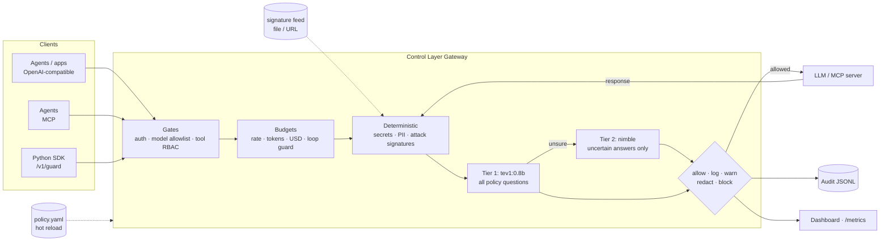

# AI Control Layer

A gateway that sits between agents, apps, LLMs and MCP tools. It inspects, redacts, blocks or just logs every interaction according to one hot-reloaded policy file. Checks run in two kinds of tiers. Deterministic tiers (regex, signatures, access control, budgets) run in microseconds. AI tiers use Ollama decision models: `tev1:0.8b` screens everything and `nimble` handles only the cases tev1 is unsure about.



The same pipeline runs in both directions. Prompts and tool calls are checked on the way out. Model replies, tool results and tool descriptions are checked on the way back, which is how it catches indirect injection, output leaks and poisoned MCP tools.

## Quick start (no models needed)

```bash
python -m venv .venv && .venv/bin/pip install -e '.[dev]'
.venv/bin/python -m pytest              # full self-test suite, ~5 s
.venv/bin/python -m controllayer        # gateway on http://127.0.0.1:8787
.venv/bin/python demo/agent.py          # scripted agent: benign steps + attacks
open 'http://127.0.0.1:8787/?token=demo-admin-token'   # dashboard
```

By default the policy uses the `mock` upstream and the `heuristic` semantic backend. The heuristic backend is a keyword stand-in for the decision model, so everything runs on a laptop with no GPU.

## With real models

```bash
docker compose up -d            # Ollama + pulls tev1:0.8b, nimble, llama3.2:1b + gateway
ACL_LIVE=1 pytest -m live       # contract test against the real /v1/systemone
```

Without Docker, set `ACL_SEMANTIC=ollama ACL_UPSTREAM=ollama` before starting the gateway. You can also edit `semantic.backend` / `upstream.backend` in `policy.yaml` while it runs. nimble needs about 10 GB of memory. On smaller machines, set `deep_model: tev1` or `deep_model: null`.

## Integrating

| Traffic | How |
|---|---|
| App/agent → model | Point any OpenAI client at `http://gateway:8787/v1`, using a control-layer API key as the bearer token |
| Agent → MCP tools | Point the MCP client at `http://gateway:8787/mcp/<server>` (servers are configured in `upstream.mcp_servers`) |
| Anything else | `controllayer.sdk.Guard`: `guard.enforce(text, direction)` or the `@guard.tool` decorator |

## Policy

All controls, thresholds, allowed models, budgets and team overrides live in [`policy.yaml`](policy.yaml), which is commented inline. Key ideas:

- **`mode`** caps how hard a control can act. The ladder is `allow < log < warn < redact < block`. A `log`-mode control only monitors.
- **`shadow: true`** evaluates a control and reports what it *would* have done, without acting. Use it to roll out a new control, or to monitor employees without interfering.
- **Semantic controls are data.** Each entry under `semantic_controls` is one question to the decision model, with probability thresholds (`noul`) or per-category actions (`choice`). To add a guardrail, add an entry; no code is needed.
- **Teams** can override any control, merged key by key.
- **Hot reload:** edits apply within about 1 s. An invalid edit is rejected, the previous policy stays live, and the error shows on the dashboard.

## Reporting

| Endpoint | For |
|---|---|
| `/` | Dashboard: posture, threats, shadow findings, controls, budgets, latency, audit trail, prompt playground |
| `/admin/audit/export?format=jsonl\|csv` | Audit log for security teams. Stores redacted text and the SHA-256 of the original, never raw secrets |
| `/admin/summary`, `/admin/events` | JSON for other tools |
| `/metrics` | Prometheus: decisions, findings, latency per stage, spend |

Admin endpoints need `x-admin-token` (or `?token=`), set with `identity.admin_token` / `ACL_ADMIN_TOKEN`.

## Performance

Run `python demo/bench.py` to benchmark the in-process pipeline with the heuristic backend. On a 2-vCPU VM it measured about 1 ms in-layer p50 and 5 ms HTTP round trip p50, at roughly 1100 decisions/s. With real decision models, latency is dominated by tev1. Deterministic blocks skip the model call, and only uncertain answers reach nimble.

See [docs/architecture.md](docs/architecture.md) for design decisions and the OWASP mapping.
