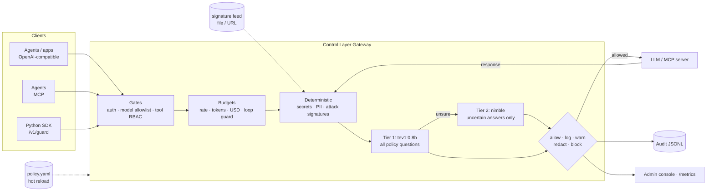

# AI Control Layer

A gateway that sits between agents, apps, LLMs and MCP tools. It inspects, redacts, blocks or just logs every interaction according to one hot-reloaded policy file. Checks run in two kinds of tiers. Deterministic tiers (regex, signatures, access control, budgets) run in microseconds. AI tiers use Ollama decision models: `tev1:0.8b` screens everything and `nimble` handles only the cases tev1 is unsure about.



The same pipeline runs in both directions. Prompts and tool calls are checked on the way out. Model replies, tool results and tool descriptions are checked on the way back, which is how it catches indirect injection, output leaks and poisoned MCP tools.

This repository is the team's merged build: Mikołaj's usage-governance fork with latekvo's Shpont-Shield merged in through git, plus pieces ported from the other team apps. See [What came from where](#what-came-from-where).

## Quick start (no models needed)

```bash
python3.12 -m venv .venv && .venv/bin/pip install -e '.[dev]'
make web                                # build the console (Node 20+); until then / is a short "console is not built" page
.venv/bin/python -m seed --data-dir data/demo           # 30 days of a 5,000-person bank
.venv/bin/python -m controllayer --data-dir data/demo   # gateway and console on http://127.0.0.1:8787
open http://127.0.0.1:8787/             # the admin console (sign in with demo-admin-token)
```

Other useful commands:

```bash
.venv/bin/python -m pytest              # full self-test suite, one worker per CPU
.venv/bin/python -m pytest -n 0 -x -k people   # in-process, stop at first failure, one area
.venv/bin/python -m controllayer --data-dir data/fresh   # same policy, empty state (or ACL_DATA_DIR)
.venv/bin/python demo/live.py           # the live demo, beat by beat, against a running gateway
.venv/bin/python demo/agent.py          # scripted agent: benign steps + attacks
open 'http://127.0.0.1:8787/legacy/'    # Shield's earlier HTML dashboard, read-only reference (not maintained)
```

`web/dist` is not committed: after pulling changes to `web/`, run `make web` again.

The shipped policy runs in **demo mode** (`identity.demo_mode: true`), so nothing asks for a credential: the console, `/admin/*` and `/metrics` skip the admin token, a caller without a known API key acts as `identity.demo_principal` (alice), and risk signals name their integration in the body. A supplied API key still identifies its owner, which is how the demo agent acts as different people. **Demo mode must be off in production** (`ACL_DEMO_MODE=false`, or `demo_mode: false` in the policy); while it is on, the gateway logs a warning at startup and `/admin/summary` reports `"demo_mode": true`.

By default the policy uses the `mock` upstream and `semantic.backend: auto`: the local prompt-injection classifier (see [Semantic tier](#semantic-tier)) when it is downloaded, otherwise the keyword fallback, a regex stand-in for a model. Either way everything runs on a laptop with no GPU.

## With real models

```bash
docker compose up -d            # Ollama (tev1:0.8b, nimble, llama3.2:1b) + Privacy Filter + gateway
ACL_LIVE=1 pytest -m live       # contract test against the real /v1/systemone
```

Without Docker, set `ACL_SEMANTIC=ollama ACL_UPSTREAM=ollama` before starting the gateway. You can also edit `semantic.backend` / `upstream.backend` in `policy.yaml` while it runs. nimble needs about 10 GB of memory. On smaller machines, set `deep_model: null` to use the fast tier alone, or `deep_model: tev1` after `ollama pull tev1`.

## Semantic tier

Without Ollama, prompt injection is scored by an open CPU classifier, `protectai/deberta-v3-base-prompt-injection-v2` (Apache-2.0, ONNX, onnxruntime, no GPU):

```bash
pip install -e '.[classifier]'                  # onnxruntime, tokenizers, numpy
python -m controllayer.semantic_model download  # ~739 MB into ~/.cache/controllayer/models (or $ACL_MODEL_DIR)
pytest -m live tests/test_semantic_classifier.py
```

With `semantic.backend: auto` (the default) the gateway uses it once the files are there; `backend: classifier` also downloads it on first use. Until it is loaded, or if it is missing, the keyword fallback answers and `/admin/summary` says so: `semantic.backend` is `"classifier"` (with `model`, `device: "cpu"`, `threshold`) or `"keyword fallback (no model)"`. Its findings carry `tier: "semantic"` and the model's score; keyword findings carry `tier: "keyword"`. P(injection) at or above `semantic.classifier.threshold` (0.9) applies the control's mode. Inputs under 24 characters and the short strings of JSON tool results are not scored. Base64 blobs are decoded and letter-spaced text (`I g n o r e  a l l ...`) is collapsed before scoring, for the classifier and the keyword fallback alike.

Measured on the red-team corpus (23 injection attacks, 30 benign prompts, plus the review's bypasses):

| | Attacks caught | Benign flagged | Latency |
|---|---|---|---|
| Keyword fallback | 12 / 23 | 0 / 30 | ~0.2 ms |
| Classifier, P >= 0.9 | 23 / 23 | 2 / 30 | 27 ms p50, 41 ms p95 (2 CPU threads) |

The two false positives were a short JSON tool result (now skipped) and "Which test card numbers does the payment sandbox accept?". The corpus is small and self-written: a strong signal, not a benchmark.

## Console

`/` is the admin console (React, `web/`, built with `make web`). It is for security, platform and FinOps people; employees have no screen of their own (their tools use the JSON under `/api/me/*` with their own key). The sidebar has a global search for people, teams and departments, and these pages:

| Page | What |
|---|---|
| Overview | Spend against the monthly budget, open incidents, spend by workflow, what needs attention, departments |
| Activity | The live event stream: every check, lease, incident and admin action |
| Security | Where incidents happen (rule by department), opened vs. closed, the incident queue, people at risk and automatic responses |
| Traps | The decoys planted for insiders, who touched one and the evidence |
| Attacks | Attack corpora fired at the live policy and what got through |
| Controls | Every control, its mode and strictness, edited through the admin overlay |
| Playground | Try a prompt or tool call against the live policy and see each check's verdict |
| Tests | The self-test and red-team results over time |
| Organization | Departments, teams and people (search, risk, spend), down to one person's page |
| Resources | The catalog: models, leasable machines and access grants, with live leases and zombies |
| Workflows | The priced menu of AI work, with measured cost per run |
| Requests | Approvals waiting for an admin: workflows, budget and time-boxed access |

Every number links to the filtered list behind it. The earlier Shield HTML dashboard is kept, read-only and unmaintained, under `/legacy/` only; [docs/console-contract.md](docs/console-contract.md) describes it.

`python -m controllayer.seed --people 2000 --days 30` generates a smaller synthetic company in Shield's format (the console's demo bank comes from `python -m seed`): people and agents in teams with daily budgets (`data/org.json`, which `identity.directory` merges into the policy), 30 days of usage across models and company services, risk scores, alerts, grants and overrides. Restart the gateway after seeding.

## Company resources for agents

Security defines a catalog in `policy.yaml` (`resources:`) with who is entitled to each resource, which scopes may be granted and the longest grant allowed. Entitled resources are delegated to agents through the API (`/me/api/*`, with the employee's own key) or granted by an admin in the console. Agents use them through the gateway's built-in `company` MCP server, which offers each service's own tools:

| Area | Services (tools) |
|---|---|
| Engineering | GitHub (`github_list_issues`, `github_get_file`, `github_create_issue`, `github_merge_pull_request`), Linear, Heroku (`heroku_get_logs`, `heroku_restart_dyno`, `heroku_scale_formation`, ...), Vercel |
| Data | PostgreSQL prod read replica (`postgres_query`: one SELECT, writes and DDL rejected), Snowflake, Supabase (`supabase_select`, `supabase_insert`), Upstash Redis, AWS S3 (`s3_get_object`, ...) |
| Revenue | Stripe (`stripe_list_charges`, `stripe_refund`, ...), Salesforce, HubSpot, Zendesk (`zendesk_get_ticket`, `zendesk_reply`, ...) |
| Collaboration, ops | Slack (`slack_post_message`, ...), Notion, Google Drive, Datadog, PagerDuty, Zapier (`zapier_trigger_zap`), SendGrid |

That is 20 services and 55 tools (`controllayer/services.py`). Each tool needs one scope: `read`, `write`, `admin` or `exec`. `tools/list` returns only the tools the caller can use right now (an agent: its live grants and their scopes; an employee: their entitlements), plus `list_resources`. Every `tools/call` is checked against the live grant for that tool's scope, including expiry, the owner's entitlement and suspension. The gateway then performs the call and **injects the credential itself** from the variable named in the catalog (`connection.secret_env`), so agents never hold secrets. Results still pass through every content check: a card number pasted into a Zendesk ticket is redacted (blocked for finance), a planted instruction in a ticket or a Notion page is blocked, and a key leaked into a file is blocked.

Two more scopes unlock no tool of their own:
- **`pii`.** The SQL services classify sensitive columns in `services.yaml` (national IDs, emails, phones, IBANs, salaries). A caller without `pii` queries a copy in which those columns are already masked, the way a Snowflake masking policy works, so no SQL function can rebuild them: `hex(national_id)` returns the hex of `****`. The content checks still run on every answer.
- **`external_share`.** Egress tools (`gdrive_share_file`, `sendgrid_send_email`, `zendesk_reply`, `slack_post_message`, `zapier_trigger_zap`) are checked before they run. What they would send (the shared file, the message, the payload) goes through the tool-call and tool-result checks, and the call is refused if any of it would be redacted, withheld or blocked. Sending to an address outside `company_domains` needs `external_share`.

A catalog entry can also limit single scopes to some of the people entitled to the resource (`scope_entitlements`). In the shipped policy, interns can read Google Drive and Notion but not share or write, and `pii` is limited to platform (Postgres) and finance (Snowflake).

The backends are deterministic mocks with realistic records (`controllayer/services.yaml`): writes answer like the real API but change nothing, and an unset credential variable falls back to a fixed demo value.

## Insider risk

Every finding adds points to the person's score, which decays with a 24 h half-life. An agent's points also count half against its owner. At `watch` the person gets a stricter policy (`insider_risk.watch_controls`) and full-text capture. At `restricted` everything is blocked. Other tools (a SIEM, an EDR) can raise a person's level with **external signals**, each capped, expiring and authenticated by that integration's own token. Security can override a person's level in either direction, or leave it on auto; an agent is never less restricted than its owner. Level changes, blocks while watched and selected categories (exfiltration, malware, leaked keys) raise **silent alerts** to the console, a JSONL file or a SIEM webhook (each sink sends native JSON, OCSF or ECS: `format:`). The employee's response is unchanged. Monitoring itself is disclosed (GDPR, Polish Labour Code art. 22³).

A person's level, strongest rule first:

1. **Override.** A level security set (`POST /admin/risk/{pid}` `{"level": "normal"|"watch"|"restricted"}`) is the level, in either direction. Scores and signals do not change it, but a rise of the auto level underneath still raises a silent alert. `auto` removes the override, and `POST /admin/risk/{pid}/reset` clears the score.
2. **Auto.** Otherwise the higher of the score-based level and the strongest active external signal.
3. **Owner.** An agent's level is the higher of its own and its owner's.

An integration listed in `identity.integrations` (`{name: {token_env, max_level, max_ttl_hours, max_sources}}`) sends `POST /admin/risk/{pid}/signal` with `Authorization: Bearer <its token>` and `{"level"` or `"score", "ttl_seconds", "source", "reason"}`. A score maps through `insider_risk.levels`. The level is capped at `max_level`. Each source (`<integration>` or `<integration>/<source>`) holds one signal, which its next signal replaces; `normal` withdraws it. An integration can only write its own sources, and at most `max_sources` (default 8) live ones per person: past that, a new source displaces the weakest, soonest-expiring one (named in the reply as `evicted`), or is refused with 429 if every live one is stronger. Stored signals count only under the current policy: removing an integration (say its token leaked) voids its signals at once, and lowering its `max_level` or `max_ttl_hours` caps them. Signals persist in `data/state.json`, are audited, show in `/admin/risk`, and raise a silent alert when they lift a level. The admin token is not accepted on this endpoint, and an integration token works nowhere else. In demo mode a call without an integration token names its integration in the body (`"integration": "wazuh"`), whose caps still apply.

## Contextual PII (OpenAI Privacy Filter)

`services/privacy_filter` serves `openai/privacy-filter` over HTTP (`docker compose` starts it). It finds names, addresses and similar spans that regexes cannot. In chat and `/v1/messages`, those spans become placeholders (`<PRIVATE_PERSON_1>`) before the model sees them and are restored in the reply, including tool-call arguments. A restored value that comes back as history is masked again wherever it appears. Two override paths exist:
- **User:** roles in `override_roles` send `x-pii-override: <reason>`.
- **Model:** the decision model judges whether the PII is needed for the task.

Both are audited, and neither can lift a `block`. The default `stub` backend is a tiny offline stand-in for demos.

## Integrating

| Traffic | How |
|---|---|
| App/agent → model | Point any OpenAI client at `http://gateway:8787/v1`, using a control-layer API key as the bearer token (optional in demo mode) |
| Claude Code, Anthropic SDKs → model | `ANTHROPIC_BASE_URL=http://gateway:8787` with a control-layer key, or a claude.ai seat plus `x-acl-key`: [`integrations/claude-code`](integrations/claude-code) |
| OpenCode, Continue, Cline / Roo, Aider | [`integrations/coding-agents.md`](integrations/coding-agents.md) |
| Agent → MCP tools | Point the MCP client at `http://gateway:8787/mcp/<server>` (servers are configured in `upstream.mcp_servers`) |
| Agent → company resources | Point the agent's MCP client at `http://gateway:8787/mcp/company` with the agent's own key |
| Anything else | `controllayer.sdk.Guard`: `guard.enforce(text, direction)` or the `@guard.tool` decorator |
| Ask before acting | `POST /v1/authorize` `{action, resource, context}` returns Allow/Deny for a catalogued resource, without doing anything |
| Usage from elsewhere | `POST /v1/events` (CloudEvents 1.0, one or a batch), `POST /v1/usage` (a quantity of a resource), `POST /v1/import/focus` (a cloud bill as FOCUS CSV) |
| Wazuh | [`integrations/wazuh`](integrations/wazuh): rules for the alert file sink, and an active response that posts risk signals back |

## Anthropic Messages API (Claude Code)

`POST /v1/messages` and `/v1/messages/count_tokens` speak Anthropic's format, streaming included, and apply the same controls as chat:

- **Request.** Every system block, message block (text, thinking, `tool_use`, `tool_result`, images, documents, unknown types) and tool definition is inspected on every call; a `tool_result` is checked as tool output, so a planted instruction or a leaked key in a file blocks the request. Apart from image and document data the gateway cannot read (below), the only fields left uninspected are the opaque ones the upstream verifies: the `signature` of a thinking block and the `data` of a redacted thinking block, each only in a reply the gateway returned, re-sent as history. The new turn (everything after the last assistant message) is metered once for budgets and the loop guard. A token count is inspected the same way, since it sends the whole conversation upstream, but is not charged.
- **Images and documents.** Text documents are read and inspected: plain-text and content-block sources, and base64 data with a text media type (`text/*`, JSON, XML, YAML, JavaScript), which is decoded for the checks and re-encoded if masked. URLs, titles and context are inspected too. The gateway cannot read PDF and other binary data, uploaded files (`file_id`) or content the upstream fetches from a URL: `upstream.anthropic.opaque_documents` decides on such documents (`block`, the default: a 400 naming the setting; `log`: forwarded and audited once, in the turn that adds it; `allow`) and `upstream.anthropic.opaque_images` on such images (default `allow`); an image whose inline data is not a string with an `image/*` media type counts as a document. Base64 that does not decode strictly and whole counts as unreadable.
- **Blocks** are `400 invalid_request_error` with the policy reason and `x-should-retry: false` (Claude Code shows any 403 as a failed login); a per-minute rate limit is a retryable 429.
- **Reply.** Each content block is checked before release: a `tool_use` is withheld if it carries a secret (the turn then ends with `end_turn`), text is redacted, and a signed thinking block is released unchanged or replaced by a notice. Placeholders are restored in text and `tool_use` input.
- **Streaming.** The upstream stream is relayed block by block: a block's deltas are held until its `content_block_stop`, checked, then re-emitted (unchanged blocks byte for byte). `ping` events keep the connection alive meanwhile.
- **Auth.** A control-layer key in `x-api-key` or `Authorization` names the caller, and the gateway calls upstream with the org key from `upstream.anthropic.api_key_env`. A caller that names itself with `x-acl-key: <control-layer key>` (Claude Code: `ANTHROPIC_CUSTOM_HEADERS`) has its own `Authorization` / `x-api-key` and `anthropic-beta` forwarded, so a claude.ai seat keeps working (`passthrough_auth`). That login is never logged or stored, and a control-layer key is never forwarded.
- **Upstream.** `upstream.anthropic.backend: anthropic` (any Messages-API URL in `url`) or `mock` (canned replies; `call-tool` in a prompt yields a `tool_use`). `anthropic-*` headers, query strings and unknown body fields pass through; upstream errors return unchanged with `retry-after`, `x-should-retry` and `anthropic-ratelimit-*`. `HEAD /api/hello` answers Claude Code's probe.
- **Budgets** count prompt-cache writes and reads as tokens, priced at 1.25x and 0.1x the input price unless `usd_per_1m_cache_write` / `usd_per_1m_cache_read` say otherwise.

## Policy

All controls, thresholds, allowed models, budgets and team overrides live in [`policy.yaml`](policy.yaml), which is commented inline. Key ideas:

- **`mode`** caps how hard a control can act. The ladder is `allow < log < warn < redact < block`. A `log`-mode control only monitors.
- **`shadow: true`** evaluates a control and reports what it *would* have done, without acting. Use it to roll out a new control, or to monitor employees without interfering.
- **Semantic controls are data.** Each entry under `semantic_controls` is one question to the decision model, with probability thresholds (`noul`) or per-category actions (`choice`). To add a guardrail, add an entry; no code is needed.
- **Teams** can override any control, merged key by key.
- **Hot reload:** edits apply within about 1 s. An invalid edit is rejected, the previous policy stays live, and the error shows as a banner on the console's Controls page. The same page edits each control live (on/off, mode, shadow, threshold, or a strict/balanced/permissive profile) through the admin overlay, so edits survive a restart.

## Reporting

| Endpoint | For |
|---|---|
| `/` | Admin console (React, `make web`): the pages listed under [Console](#console) |
| `/api/me/*` | JSON for an employee's own tools, with their own API key: usage, quota, menu, runs, leases, blocked events, admin activity about them |
| `/admin/overview`, `/admin/usage?by=workflow,task`, `/admin/menu`, `/admin/leases`, `/admin/incidents`, `/admin/principals`, `/admin/requests`, `/admin/actions` | Governance JSON; POST variants change restrictions |
| `/admin/catalog`, `/admin/grants` | The resource catalog by class, with usage, live leases and live grants |
| `/admin/export/focus?days=30` | AI spend as a FinOps FOCUS 1.1 CSV, ready for finance tools |
| `/admin/export/backstage` | The catalog as Backstage `kind: Resource` entities |
| `/admin/audit/export?format=jsonl\|csv\|ocsf\|ecs` | Audit log for security teams: `jsonl` and `csv` are the gateway's decisions; `ocsf` and `ecs` add admin actions and insider-risk alerts as one NDJSON stream for a SIEM: [OCSF 1.9.0](https://schema.ocsf.io/1.9.0/) or ECS 9.5 (Elastic, Wazuh). Detected PII and secrets are masked in every event, whatever the action; the SHA-256 of the original is kept |
| `/admin/summary`, `/admin/events` | JSON for other tools |
| `PATCH /admin/controls/{name}`, `/admin/controls/profile` | Edit one control live (`enabled`, `mode`, `shadow`, `threshold`) or apply a strict/balanced/permissive profile; written to the admin overlay, an invalid value returns 400 with the validation message |
| `/metrics` | Prometheus: decisions, findings, latency per stage, spend |

Outside demo mode, admin endpoints need `x-admin-token` (or `?token=`), set with `identity.admin_token` / `ACL_ADMIN_TOKEN`.

## Usage governance

The same gateway meters and limits *what AI work costs*, not just what it says.

- **Workflow menu.** `menu.workflows` lists the kinds of work people do with AI (`pr_review`, `ui_qa`, `data_analysis`, ...). Each item says who may run it, which models, tools and resources it uses, what one run may cost, and whether it needs approval. Clients label traffic with `x-acl-workflow`, `x-acl-task` and `x-acl-session` headers. Unlabeled chat is attributed by one extra question in tev1's existing call. That guess is used for reporting only and never to refuse a request.
- **Measured prices.** Every item shows what a run really costs (typical and p90), computed from history. Costs include tokens, simulator and VM minutes, and CI minutes.
- **Resources beyond tokens.** MCP tools that start a simulator, VM or browser (`boot_simulator`, argent's `boot-device`, `create_vm`) open a **lease**, and stop tools close it. The gateway bills leases per minute, caps how many each person can run at once, and flags leases idle past a limit (zombies). Resources can be set to stop zombies automatically. Usage the gateway cannot see is reported with `POST /v1/usage`.
- **Restrictions.** Admins can quarantine (read-only tools, 10% budget), revoke, scale budgets, approve workflows, and turn menu items off. Each change is validated, written to `data/admin-overlay.yaml` (merged over `policy.yaml`, hot-reloaded) and logged with a reason. Past 80% of a budget, requests are routed to a cheaper model instead of being refused.
- **Security from usage.** Detections combine usage with verdicts: probing (repeated blocks), exfiltration (double weight when it comes with a token spike), usage spikes, a key used from a new client, sensitive tools an agent never used before, repeated secret pastes, and zombie or unlabeled resources. Incidents add to a per-person **risk score** that halves every 2 h. Crossing thresholds first tightens the person's budget, then quarantines them. Only an admin relaxes a restriction.
- **One console.** `/` is the admin console for platform, FinOps and security people. Employees have no screen of their own; `/api/me/*` gives their tools the same facts with their own API key: spend, budgets, menu prices, runs, running resources, what was blocked and why, and every admin action or content view concerning them. Viewing one person's events needs a stated reason, which that person can see.

```bash
.venv/bin/python -m controllayer &
.venv/bin/python demo/governance.py          # labelled work, simulators, an approval, an insider escalating
open http://127.0.0.1:8787/   # sign in with demo-admin-token
```

Usage, leases, incidents and approvals are stored in SQLite (`usage.path`), so budgets and history survive restarts.

## Resource catalog

Everything an agent can touch is an entry under `catalog:` in `policy.yaml`. An entry might be a model, a subscription, a simulator, a VM, CI minutes, a cloud account, the production database, a deploy or external email. Each one is named by a URN (`urn:shield:<category>:<provider>:<type>`) and belongs to one of three classes, each measured and limited differently:

| Class | Examples | Measured in | Limited by |
|---|---|---|---|
| `consumable` | LLM tokens, Claude Code usage, CI minutes, cloud spend | a quantity in a unit | daily budgets per person, team and workflow; a cheaper model past 80% |
| `leasable` | iOS simulators, sandbox VMs, browsers | minutes held | concurrent leases, maximum duration, idle shutdown |
| `access_grant` | prod database, prod deploy, external email | uses | a time-boxed grant approved by an admin, or a workflow that includes it |

There is one evaluator for all three classes (`controls/resources.py: authorize`), in Cedar's shape: a principal, an action, a resource and a context. The gateway uses it on every tool call, and `POST /v1/authorize` exposes it to other systems. Employees request a grant through the API with their own key (`POST /me/requests`), and admins approve it on the Requests page or grant it directly (`POST /admin/principals/{id}/grants`). A grant is stored in the shape of an OAuth RAR (RFC 9396) `authorization_details` entry: resource, URN locations, actions, an optional workflow and an expiry. While it is live, it also lets the tool past the role list and the irreversible list. Each grant is logged, and the employee can see it through `/api/me/*`.

The catalog is built on existing standards rather than a home-grown format:

| Concern | Standard |
|---|---|
| Decisions | Cedar's principal / action / resource / context |
| Identity | URNs (like AWS ARNs), with wildcards |
| Catalog | Kubernetes-style entries, exported to Backstage |
| Events | CloudEvents 1.0, with OpenTelemetry GenAI attributes |
| Cost records | FinOps FOCUS 1.1 export and import |
| Grants | OAuth RAR `authorization_details` |
| Quota signalling | IETF `RateLimit-Policy` / `RateLimit` headers |

Older policies with `resources:` and `budgets.pricing` still load: they are folded into the catalog.

## Traps

Some things in a company should never be touched by anyone: nothing legitimate needs them. `decoys:` in `policy.yaml` plants a few that look real and valuable, like an unpublished Q3 board pack in the finance folder or a "full customer master export" in the data catalog. They are listed where people and agents look (document search, the catalog), so finding one is harmless. Using one is not:

| What happened | Rule | Effect |
|---|---|---|
| A tool call names the decoy (MCP, or a Claude Code `Read` of a planted file) | `decoy_touch` (weight 100) | High-severity incident, quarantine at once |
| The decoy's marker shows up in a prompt or tool call: its content is being moved on | `decoy_touch` | Same |
| A prompt asks for it by name ("the unpublished board pack") | `decoy_mention` (weight 30) | An alert: maybe just curiosity |

The gateway answers an opening call itself with the decoy's fake `content`, so no real system is involved and the person sees an ordinary result. Search results, tool results and conversation history never count. Employees never learn that it was a trap: in everything they can see about themselves it is "restricted material". Admins see each trap, where it is planted and who touched it on the Traps page (`/console/traps`, API `GET /admin/decoys`).

To catch Claude Code too, put a file with a decoy's name in the repositories people work in (for example `finance/board-pack-Q3-2026-UNPUBLISHED.pdf`): the `PreToolUse` hook sees the `Read`.

## Attacks (Redteam sidecar)

`redteam/` is a separate process that attacks this gateway around the clock and scores what gets through (Console > Attacks). It fires a corpus of known attacks (`redteam/corpus/attacks`, must be stopped), normal work requests (`redteam/corpus/benign`, must pass) and disguised rewrites of every attack (leet, homoglyphs, zero-width, spacing, base64, role-play) through `POST /admin/try`, which runs the full pipeline but never meters, scores or audits the caller.

- **Posture** 0-100 = 100 x protection x (1 - friction): blocking everything scores 0, so does blocking nothing.
- It re-runs every 30 s and at once when the gateway's configuration fingerprint changes (policy, feed, controls, risk levels), and records what each change did: posture before and after, attacks opened or closed, new false positives. Change a control on the Controls page and the effect shows on Attacks within seconds.
- **Feed health** self-tests the signature feed the gateway enforces: every signature must compile, match its own `tests.match` examples and stay quiet on `tests.clean`.

```bash
make demo                    # the gateway on :8787
make redteam                 # the sidecar on :8799 (REDTEAM_PORT), attacking :8787 (PORT)
make redteam-ci              # CI gate, the same as:
cd redteam && ../.venv/bin/python -m shield_redteam run --min-posture 90 && ../.venv/bin/python -m shield_redteam feed --check
```

`pip install -e redteam` also gives the `shield-redteam` command (`shield-redteam run --min-posture 90 && shield-redteam feed --check`). Settings live in `redteam/redteam.yaml` (`SHIELD_URL`, `ACL_ADMIN_TOKEN`, `REDTEAM_PORT`, `REDTEAM_FEED`). The console reads the sidecar through the gateway at `/api/admin/redteam/{state,stage,run,report,report.md}` (admin token required), forwarded to `ACL_REDTEAM_URL` (default `http://127.0.0.1:8799`); when it is down that answers 503 `{"error": "redteam not running"}` and the page shows how to start it. The sidecar never edits the gateway's configuration. Its own tests: `make redteam-test`.

## Claude Code

Claude Code reports to the gateway and is governed by the same `policy.yaml`. The setup is in [`deploy/claude-code/`](deploy/claude-code/README.md).

- **Observe:** its OpenTelemetry export (OTLP over HTTP JSON at `/v1/logs` and `/v1/metrics`) provides cost and tokens per API call, tool accept and reject decisions, lines of code, commits, PRs and active time. People are identified by their key, or by `user.email` when a central collector forwards telemetry. Money comes only from `api_request` events, so it is never counted twice, and prompt text is never stored.
- **Enforce:** hooks (`/v1/hooks/claude-code`) check every prompt before it is sent and every tool call before it runs. The checks cover secrets, PII, signatures, budgets, the role's and workflow's tool lists, access grants and simulator caps. The hooks also open and close leases for MCP simulators. HTTP hooks fail open; the command-hook variant fails closed.
- **Detect:** bypass permission mode, MCP servers that are not on the approved list, and a run of rejected tool calls each open an incident.

This was verified live with Claude Code 2.1.288: a pasted AWS key was blocked before it was sent, and the session's cost showed up under `bugfix/DEMO-1`.

## One event stream

Gateway checks, lease starts and stops, incidents, usage reports, CloudEvents and imported bills all land in the `events` table, with one set of fields: source, kind, who (principal, team, client, session), what for (workflow, task), on what (resource, URN, model, tool), the decision, severity and cost. Telemetry that names a person by email is joined to the directory through `identity.api_keys.*.email`. Events that carry cost are also written to the usage ledger and count against today's budgets. A missing price is taken from the catalog.

## Performance

`python demo/bench.py` measures the pipeline in-process, with budgets lifted and the heuristic backend. Add `--gateway http://127.0.0.1:8787` to measure over real HTTP. On a busy 2-vCPU VM:

| Mode | Decisions/s | In-layer p50 / p95 | Round trip p50 |
|---|---|---|---|
| In-process (ASGI) | ~1000 | 1.1 / 1.4 ms | 6 ms |
| HTTP to a running gateway | ~450 | 1.3 / 3.0 ms | 13 ms |

With real decision models, latency is dominated by tev1. Deterministic blocks skip the model call, and only uncertain answers reach nimble.

See [docs/architecture.md](docs/architecture.md) for design decisions and the OWASP mapping.

## What came from where

Five apps were built in parallel by the team; this one is their merge.

| Who | App | What it brought |
|---|---|---|
| latekvo | Shpont-Shield | The gateway core it merged in through git: the Anthropic Messages proxy for Claude Code, the MCP broker and company resources, insider risk with external signals, the Privacy Filter, OCSF/ECS audit export, `/metrics`, and the HTML dashboard now under `/legacy/` |
| Dawid | Shpont-Shield-Behavior (Warden) | Judging agents by what they do, not only by what they say: behavior signals behind the person page and insider risk |
| Dotims | Shpont-Shield-Redteam | Poligon and Tripwire: the attack corpora behind Attacks and Tests, and the decoys behind Traps |
| Nikodem | SzpontyShield | The agent console and demo scenarios behind the Playground, and the policy editor ideas behind Controls |
| Mikołaj | Shpont-Shield-Usage | The base: usage governance (workflows, leases, requests, budgets at company scale) and the React admin console with its sidebar and global search |
